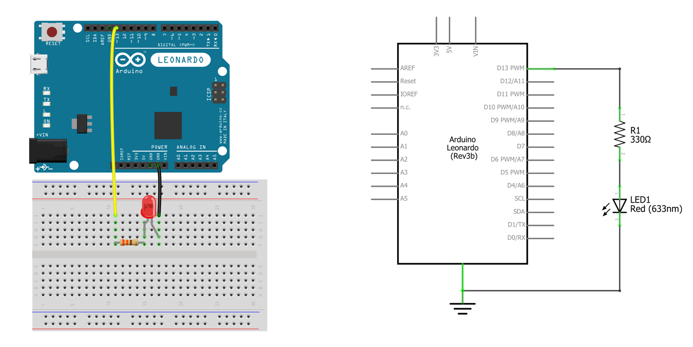
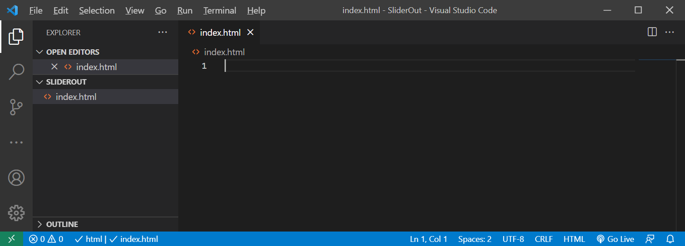
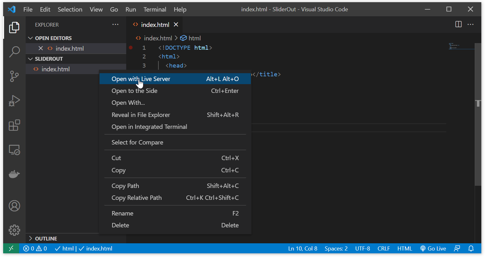
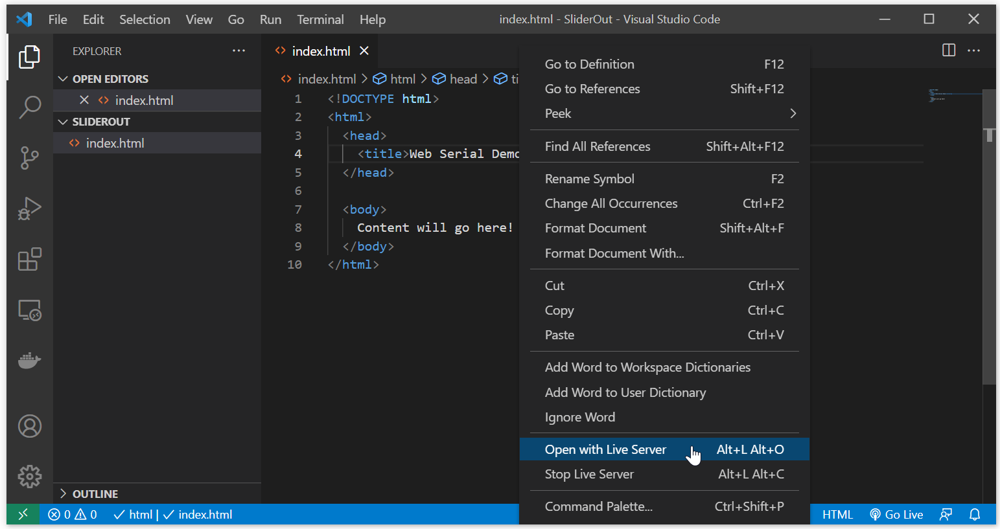
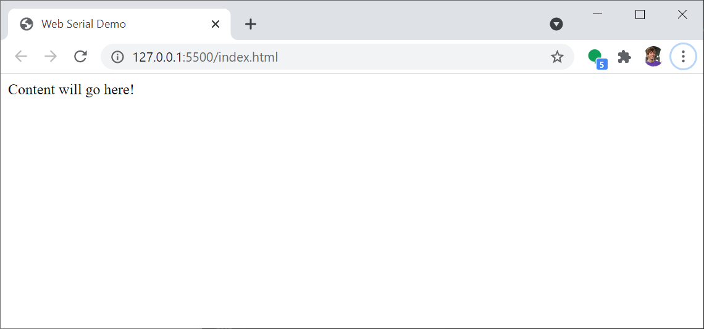
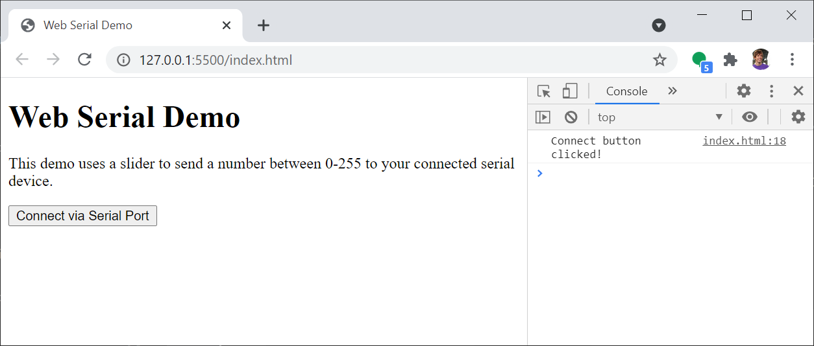
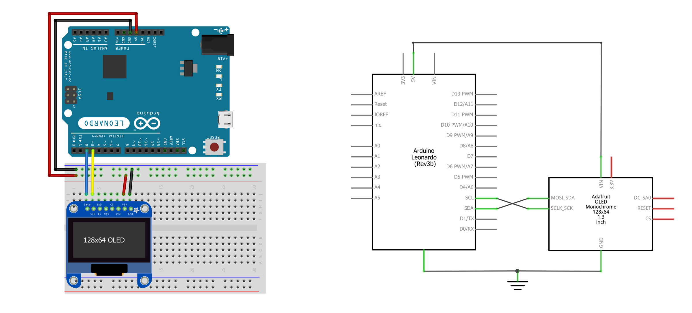
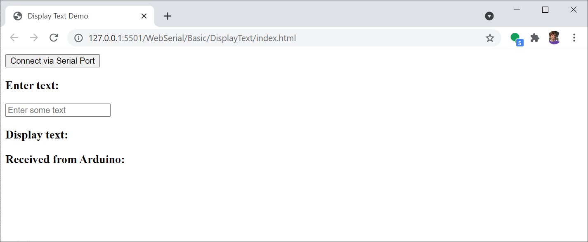

# {{ page.title }}
{: .no_toc }

## Table of Contents
{: .no_toc .text-delta }

1. TOC
{:toc}
---

In our [previous lesson](serial-intro.md) we dove deeper into asynchronous serial communication, Arduino's [Serial functionality](https://www.arduino.cc/reference/en/language/functions/communication/serial/), and how we can write computer programs, like [serial_demo.py](https://github.com/makeabilitylab/arduino/blob/master/Python/Serial/serial_demo.py), to bidirectionally communicate with Arduino.

In this lesson, we will apply our growing serial knowledge to a new context: the web! Now, it may seem a bit weird to use a web browser to communicate with a locally connected device. But, if you think about it, we actually do this all the time using video chat in our web browsers: the w3c [MediaDevices API](https://developer.mozilla.org/en-US/docs/Web/API/MediaDevices) provides regulated access to media input devices like cameras and microphones.

More recently, the w3c spec'd out an API for securely providing access to Universal Serial Bus (USB) devices from web pages called [WebUSB](https://wicg.github.io/webusb/#security-and-privacy). Just like the [MediaDevices API](https://developer.mozilla.org/en-US/docs/Web/API/MediaDevices), security and privacy is paramount. Web pages requesting access to local USB devices must seek explicit user permission, which is handled through the web browser. Chrome added support for WebUSB in late 2017.

However, WebUSB did not include support for USB-to-serial devices like Arduino. Thus, the [Web Serial API](https://wicg.github.io/serial/) was proposed and launched in Chrome 89 (in March 2021). This is what we will be using for the next few lessons.

## Why Web Serial?

While we've previously taught computer-Arduino serial communication using [Processing](https://processing.org/) and [Python](https://www.python.org/), using Web Serial let's us combine Arduino with a creative, fast-changing context: the Web. Web Serial also lets us utilize all of the wonderful web-based tools and APIs like [p5js](https://p5js.org/), [ml5js](https://ml5js.org/), [paper.js](http://paperjs.org/), [three.js](https://threejs.org/), [matter.js](https://brm.io/matter-js/), and more!

Of course, if your Arduino board has built-in WiFi, you can communicate directly with web servers (as we explore a bit in the [ESP32 IoT lesson](../esp32/iot.md)); however, in this case, we assume either a tethered connection via serial over USB or a local wireless connection via serial over Bluetooth.

Much of what we do with Web Serial could be translated to a WiFi context. 

## The Web Serial API

In the words of [François Beaufort](https://web.dev/serial/), the Web Serial API:

> bridges the web and the physical world by allowing websites to communicate with serial devices, such as microcontrollers and 3D printers
{: .fs-3 }

Web Serial is already being used in web tools like [Microsoft's MakeCode](https://makecode.adafruit.com/), which lets you program microcontrollers via a drag-and-drop visual programming language and [Arduino's Web Editor](https://create.arduino.cc/editor), which lets you write code from the browser, store work in the cloud, and upload sketches directly from the web.

### Does my web browser support Web Serial?

At the time of this writing (May 2021), **Chrome** and **Edge** versions 89+ are the only browser to support Web Serial but more should be coming soon! To check if the Web Serial API is supported, view Mozilla's [browser compatibility chart](https://developer.mozilla.org/en-US/docs/Web/API/Serial#browser_compatibility). Alternatively, open your dev tool console on your web browser (on Windows, type `ctrl-shift-i` in Chrome or Firefox; on Mac, type `cmd-alt-i`).


> "serial" in navigator
true


If true, then there is browser support. If false, then there is not.

### How to use the Web Serial API

[François Beaufort](https://web.dev/serial/) provides a nice overview of how to use the Web Serial API. Please read [their website](https://web.dev/serial/) for detailed information.

But, in short. The Web Serial API is asynchronous and event based. This prevents websites from blocking when awaiting input from Web Serial.

#### Requesting permission to communicate with a serial device

To open a serial port, we must first request a port. For security, this call is managed by the browser and pops-up a dialog box asking the user to select a serial port and grant the website permission. Code based on François Beaufort's [blog post](https://web.dev/serial/).


// Prompt user to select any serial port.
const port = await navigator.serial.requestPort();


The [`await`](https://developer.mozilla.org/en-US/docs/Web/JavaScript/Reference/Operators/await) keyword waits for the asynchronous `requestPort()` function to return.

Similar to [iPython](https://ipython.org/), one amazing feature of JavaScript is that we can dynamically program it in the developer console and even interact with the current website's variables, *etc.*

So, you can try the above command yourself. In the browser's dev tool console, type:


> await navigator.serial.requestPort();


If your Arduino is plugged in, you should see something like this:

**Figure.** If I type `navigator.serial.requestPort()` into Chrome's dev console with my Arduino Leonardo plugged into my laptop's USB, I receive the prompt shown above.
{: .fs-1 }

#### Opening the serial port

To open the serial port, we call `port.open(SerialOptions)`. [SerialOptions](https://reillyeon.github.io/serial/#dom-serialoptions) is a dictionary with serial option parameters defined as:


dictionary SerialOptions {
  required [EnforceRange] unsigned long baudRate;
  [EnforceRange] octet dataBits = 8;
  [EnforceRange] octet stopBits = 1;
  ParityType parity = "none";
  [EnforceRange] unsigned long bufferSize = 255;
  FlowControlType flowControl = "none";
};


These options should look familiar. We have:
- `baudRate`: the only **required** option that must be an integer value like 9600 or 115200
- `dataBits`: The number of data bits per frame (either 7 or 8).
- `stopBits`: The number of stop bits at the end of a frame (either 1 or 2).
- `parity`: The parity mode (either "none", "even" or "odd").
- `bufferSize`: The size of the read and write buffers that should be created (must be less than 16MB).
- `flowControl`: The flow control mode (either "none" or "hardware").

So, to open a port with 9600 baud, we would write:


// Prompt user to select any serial port.
const port = await navigator.serial.requestPort();

// Wait for the serial port to open.
await port.open({ baudRate: 9600 });


#### Writing data

To write binary data, we use `getWriter()` and `write()`. We must call `releaseLock()` in order for the serial port to be closed later.


const writer = port.writable.getWriter();

// Writing the ASCII values for the world 'h', 'e', 'l', 'l', 'o'
// as binary data
const data = new Uint8Array([104, 101, 108, 108, 111]);
await writer.write(data);

// Allow the serial port to be closed later.
writer.releaseLock();


For text data, we use a `TextEncoderStream`:


const textEncoder = new TextEncoderStream();
const writableStreamClosed = textEncoder.readable.pipeTo(port.writable);

const writer = textEncoder.writable.getWriter();

await writer.write("hello");

// Allow the serial port to be closed later.
writer.releaseLock();


#### Reading data

Reading data is similar. We use `getReader()` and the `read()` methods. We'll describe the text reading solution below. You can learn about binary reading [here](https://web.dev/serial/#read-port).


const textDecoder = new TextDecoderStream();
const readableStreamClosed = port.readable.pipeTo(textDecoder.writable);
const reader = textDecoder.readable.getReader();

// Listen to data coming from the serial device.
while (true) {
  const { value, done } = await reader.read();
  if (done) {
    // Allow the serial port to be closed later.
    reader.releaseLock();
    break;
  }
  // value is a string.
  console.log(value);
}


## Our Web Serial class

To make it easier to work with Web Serial, we wrote a basic Web Serial JavaScript class called [`serial.js`](https://github.com/makeabilitylab/p5js/blob/master/_libraries/serial.js). 

To use our Web Serial class, you can clone our [p5js repo](https://github.com/makeabilitylab/p5js) and include `serial.js` from `_libraries/serial.js` or use the [jsDelivr](https://www.jsdelivr.com/) service, which turns any GitHub repo into a CDN and directly serves `serial.js` from our GitHub repo. 

For the latter, in the `<head>` or `<body>` of your html file, simply add:





Currently, [`serial.js`](https://github.com/makeabilitylab/p5js/blob/master/_libraries/serial.js) supports just reading/writing text data (rather than binary data) but that shouldn't affect us!

### Event-based functions

[`serial.js`](https://github.com/makeabilitylab/p5js/blob/master/_libraries/serial.js) uses an event-based architecture with callback functions, which is common in web and UI programming (see: Mozilla's [Introduction to Events](https://developer.mozilla.org/en-US/docs/Learn/JavaScript/Building_blocks/Events)). The Serial class has four events, which correspond to the connection opening, closing, receiving data, and errors.


const SerialEvents = Object.freeze({
  CONNECTION_OPENED: Symbol("New connection opened"),
  CONNECTION_CLOSED: Symbol("Connection closed"),
  DATA_RECEIVED: Symbol("New data received"),
  ERROR_OCCURRED: Symbol("Error occurred"),
});


To create a new Serial object and subscribe to the events, you would write:


// Setup Web Serial using serial.js
const serial = new Serial();

// Subscribe to the events.
serial.on(SerialEvents.CONNECTION_OPENED, onSerialConnectionOpened);
serial.on(SerialEvents.CONNECTION_CLOSED, onSerialConnectionClosed);
serial.on(SerialEvents.DATA_RECEIVED, onSerialDataReceived);
serial.on(SerialEvents.ERROR_OCCURRED, onSerialErrorOccurred);

// Called by Serial when an error occurs
function onSerialErrorOccurred(eventSender, error) {
  console.log("onSerialErrorOccurred", error);
}

// Called by Serial when a serial connection opens
function onSerialConnectionOpened(eventSender) {
  console.log("onSerialConnectionOpened");
}

// Called by Serial when a connection closes
function onSerialConnectionClosed(eventSender) {
  console.log("onSerialConnectionClosed");
}

// Called by Serial when new data is received
function onSerialDataReceived(eventSender, newData) {
  console.log("onSerialDataReceived", newData);
}


You need not subscribe to *all* the events—just the ones you need. However, subscribing to all of them does provide you with more information if something goes wrong.

### Opening the serial port

To open a serial port, you call `connect()` followed by `open()`. The method signatures are:


async connect(existingPort = null, portFilters = null)
async open(serialOptions = { baudRate: 9600 }) {


The `connect()` method takes two optional parameters:

- `existingPort`: a previously created serial port (*e.g.,* returned from `navigator.serial.requestPort()`). This will typically be null
- `portFilters`: a [SerialPortFilter](https://reillyeon.github.io/serial/#serialportfilter-dictionary) dictionary. This will also typically be null.

The `open()` method takes in the previously described [SerialOptions](https://reillyeon.github.io/serial/#dom-serialoptions) dictionary. If no parameter is passed, the dictionary defaults to `serialOptions = { baudRate: 9600 }`.

For convenience, there are two additional methods `connectAndOpen()` and `autoConnectAndOpenPreviouslyApprovedPort()`—we typically use these:


// Prompts user for approval to connect to a serial device and opens the port to
// approved device 
async connectAndOpen(portFilters = null, serialOptions = { baudRate: 9600 })

// Automatically connects and opens the previously approved port
// If there are more than one, it takes the top port in the approved port list
async autoConnectAndOpenPreviouslyApprovedPort(serialOptions = { baudRate: 9600 })


The `connectAndOpen()` method simply combines the two `connect()` and `open()` function calls. The auto-connect function takes advantage of the web browser's permission caching—you need only approve a device once per webpage.

## Let's make stuff

We'll begin by running the same Arduino code ([SimpleSerialIn.ino](https://github.com/makeabilitylab/arduino/blob/master/Serial/SimpleSerialIn/SimpleSerialIn.ino)) with the same circuit as the [previous lesson](serial-intro.md). The circuit:

**Figure.** The corresponding circuit for [SimpleSerialIn.ino](https://github.com/makeabilitylab/arduino/blob/master/Serial/SimpleSerialIn/SimpleSerialIn.ino). Made in Fritzing and PowerPoint.
{: .fs-1}

Now, let's build a simple webpage using Web Serial to interact with ([SimpleSerialIn.ino](https://github.com/makeabilitylab/arduino/blob/master/Serial/SimpleSerialIn/SimpleSerialIn.ino)).

### Web dev tools

We recommend developing web code in [Visual Studio Code (VSCode)](https://code.visualstudio.com/) with the [Live Server](https://marketplace.visualstudio.com/items?itemName=ritwickdey.LiveServer) extension. Because Web Serial requires device permissioning, you must run your webpage on a server rather than opening up `index.html` directly from your OS (in other words, doubling clicking on `index.html` in File Explorer or Finder won't work properly).

To install Live Server, open VSCode and click on `Extensions` in the left sidebar (or type `ctrl-shift-x`) then search for [Live Server](https://marketplace.visualstudio.com/items?itemName=ritwickdey.LiveServer) in the textbox. At the time of writing, the extension has nearly 12 million installs.

To use Live Server, open a `.html` page in VSCode. Then, you can either right-click on the file and select "Open with Live Server" or, in the bottom-right hand corner of VSCode, look for a blue 'Go Live' button. Click it and boom, you're running a web server, serving the webpage! By default, the server will reload whenever the html file or any of its dependencies change!

### Basic slider webpage

We're going to build a simple webpage with a slider that transmits a value between 0 and 255 as a text-encoded string via Web Serial. The Arduino receives the text value and converts it to an `int` then writes out that integer via `analogWrite` via one of the PWM-enabled pins.

The full app experience should look like this:

<video autoplay loop muted playsinline style="margin:0px">
  <source src="assets/videos/SimpleSerialIn-JavaScript-SliderOut-Snippet720p.mp4" type="video/mp4" />
</video>
**Video.** Running the SliderOut demo ([live page](https://makeabilitylab.github.io/p5js/WebSerial/Basic/SliderOut), [code](https://github.com/makeabilitylab/p5js/tree/master/WebSerial/Basic/SliderOut)) with [SimpleSerialIn.ino](https://github.com/makeabilitylab/arduino/blob/master/Serial/SimpleSerialIn/SimpleSerialIn.ino) on the Arduino Leonardo.
{: .fs-1 }

#### Create folder and initial index.html page

To begin, create a folder called `SliderOut` and an empty `index.html` file within it. Then, in VSCode select `File->Open Folder` and select `SliderOut`. With the `Explorer` view open in VSCode's left sidebar (`ctrl-shift-e`), double click on the `index.html` file to open it. Now, VSCode should look something like this:

In `index.html`, copy/paste this simple, minimalist html page:


<!DOCTYPE html>
<html>
  <head>
    <title>Web Serial Demo</title>
  </head>

  <body>
    Content will go here!
  </body>
</html>


Save the file (`ctrl-s`). Now, to make sure everything is working, launch it via Live Server.

There are three ways to launch Live Server—any will work! You can enlarge any of the screenshots below by right-clicking on them and selecting 'Open Image in New Tab'.

| 1. Right-click on file in Explorer View | 2. Right-click on file in Editor | 3. Click 'Go Live' Button |
|----|----|----|
|  |  |  |

Once launched, your default web browser will open to a web server running at `127.0.0.1` on port 5500 (Live Server's defaults). The webpage should look like this:

Now, let's add in a title header in an `<h1>` block and some descriptive text:


<!DOCTYPE html>
<html>
<head>
  <title>Web Serial Demo</title>
</head>

<body>
  
  <h1>Web Serial Demo</h1>
  This demo uses a slider to send a number between 0-255 to your connected serial device.
</body>
</html>


If you hit `ctrl-s`, the website should automatically reload if you still have Live Server running. If not, just relaunch the webpage with Live Server (and keep it running as we build out).

#### Add a connect button

Because Web Serial requires explicit user permission to connect to a local serial device, we need to add a "connect button". To do that, we'll use the HTML [`<button>`](https://developer.mozilla.org/en-US/docs/Web/HTML/Element/button) element and specify a callback function called `onConnectButtonClick()` (we could name this anything we want but it will need to match the subsequent callback function that we write).


<!DOCTYPE html>
<html>
<head>
  <title>Web Serial Demo</title>
</head>

<body>
  
  <h1>Web Serial Demo</h1>
  This demo uses a slider to send a number between 0-255 to your connected serial device.

  

  <button id="connect-button" onclick="onConnectButtonClick()">Connect via Serial Port</button>

  
</body>
</html>


Reload the webpage and open the dev console (which you should almost always keep open when web developing). Click on the "Connect via Serial Port" button and you should see the message "Connect button clicked!" printed to console.

#### Add and hook up serial.js

Now we need to add in and hook up Web Serial, which we'll do via the [`serial.js`](https://github.com/makeabilitylab/p5js/blob/master/_libraries/serial.js) library. In HTML, scripts can be placed in the `<body>`, `<head>`, or both. Pages load from top-to-bottom. In this case, we'll put it at the top of the `<body>`.


<body>
  

   ...


Now we need to create the Serial object and add in the callback functions. Add the following to the `


While you could save and reload the webpage at this point, nothing noticeably will happen because we haven't actually hooked up the `Serial` object to the connect button yet. So, let's do that now. Update `onConnectButtonClick()` to connect and open the serial port. 


async function onConnectButtonClick() {
  console.log("Connect button clicked!");

  if (navigator.serial) {
    if (!serial.isOpen()) {
      await serial.connectAndOpen();
    } else {
      console.log("The serial connection appears already open");
    }

  } else {
    alert('The Web Serial API does not appear supported on this web browser.');
  }
}


Now save and reload. With your Arduino plugged into your computer, try clicking the `Connect via Serial Port` button. Once the button is clicked, the web browswer will enumerate all available serial devices and ask for user permission. It should look something like this:

<video autoplay loop muted playsinline style="margin:0px">
  <source src="assets/videos/SliderOutScreenRecording_ButtonJustHookedUp-Optimized.mp4" type="video/mp4" />
</video>

#### Add and hook up a slider

Finally, let's add and hook up an interactive slider to select and send values between 0 and 255 as text via serial. Slider widgets are specified as [`<input type="range">`](https://developer.mozilla.org/en-US/docs/Web/HTML/Element/input/range) in HTML.

Below our `<button>` HTML in the `<body>`, add in the slider. We will specify a minimum, maximum, and initial value as well as a callback function for whenever the slider value changes.


<button id="connect-button" onclick="onConnectButtonClick()">Connect via Serial Port</button>
<input id="slider" type="range" min="0" max="255" 
    value="128" onchange="onSliderValueChanged(this, event)" />


Now, in the `
</head>

<body>
  
</body>
</html>


#### Add connect button and initial interface

In the body, add in the connect button and initial interface:


<body>
  

    <button id="connect-button" onclick="onButtonConnectToSerialDevice()">
      Connect via Serial Port
    </button>
    

      <h3>Enter text:</h3>
      <input placeholder="Enter some text" name="input-text" />

      <h3>Display text:</h3>
      

      <h3>Received from Arduino:</h3>
      

    

  

</body>


Save and open with Live Server. It should look like this:

#### Hook up connect button and serial

Now, let's hook up the connect button and add in the initial Web Serial code—both will be the same as before. Add a `


#### Hook up event listener to textbox

In our web app, you may have noticed that we have no "submit" button. Instead, the text data is sent immediately as the user types in the textbox. To achieve this, we need to hook up an event listener to the textbox. We'll have the event listener call our function called `updateOutputText(e)` whenever there is new input. Inside `updateOutputText`, we'll both send the text data to Arduino via serial and update the `

` with the text sent. 

So, add the following to the beginning of our `


#### Update received-text with data received from Arduino

Finally, we need to listen for the data received back from the Arduino and update `

`. Make two additions to your existing script:





At this point, you should be able to run the web app and have it communicate with your Arduino. You should try it! We can also polish our app with two UI updates.

#### Hide UI until serial connection is made

When a serial connection is made, we will hide the connect button and show the text entry interface:


function onSerialConnectionOpened(eventSender) {
  console.log("onSerialConnectionOpened");
  document.getElementById("connect-button").style.display = "none";
  document.getElementById("text-interface").style.display = "block";
}


#### Add CSS

We will also prettify our UI with some basic CSS. Within the `DisplayText` project, create the folder `css` and the CSS file `styles.css` and put in:


#main-content {
  margin: auto;
  width: 800px;
  border: 3px solid rgb(216, 216, 216);
  padding: 10px;
}

input{
    min-width: 400px;
}

#text-interface{
    display: none;
}


Then, in `index.html` add the following to the `<head>` to hook up the CSS.


<head>
  ...
  <link rel="stylesheet" href="css/styles.css">
  ...
</head>


You did it! Now, play and experiment!

#### Full DisplayText video demo

<video autoplay loop muted playsinline style="margin:0px">
  <source src="assets/videos/DisplaySerialTextIn-FullSpedUp-Optimized.mp4" type="video/mp4" />
</video>
**Video.** The full DisplayText demo ([live page](https://makeabilitylab.github.io/p5js/WebSerial/Basic/DisplayText/), [code](https://github.com/makeabilitylab/p5js/tree/master/WebSerial/Basic/DisplayText)) with [DisplayTextSerialIn.ino](https://github.com/makeabilitylab/arduino/blob/master/Serial/DisplayTextSerialIn/DisplayTextSerialIn.ino) on the Arduino Leonardo.
{: .fs-1 }

## Activity

For your prototyping journals, either modify or create your own lil web app to communicate with the Arduino. You can, of course, also write custom Arduino code to receive and parse data or to transmit custom data. Take a video, link to your code, and write a brief description and reflection.

## Resources

- [Web Serial API Living Document](https://wicg.github.io/serial/), w3c Community Group Draft Report

- [Read from and write to a serial port from the web](https://web.dev/serial/), François Beaufort

## Next Lesson

In the [next lesson](p5js-serial.md), we'll show how to use [p5js](https://p5js.org/) with Web Serial. It's gonna be great fun!

[Previous: Intro to Serial](serial-intro.md){: .btn .btn-outline }
[Next: Using p5js with Web Serial](p5js-serial.md){: .btn .btn-outline }
<!-- [Next: Using potentiometers](potentiometers.md){: .btn .btn-outline } -->
